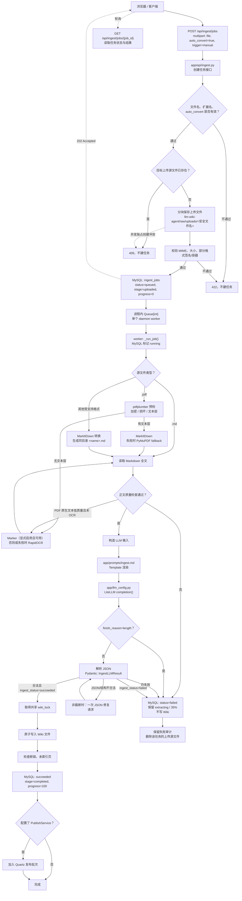

```mermaid
flowchart TB
  Client["浏览器 / 客户端"]
  Post["POST /api/ingest/jobs<br/>multipart: file, auto_convert=true, trigger=manual"]
  Api["app/api/ingest.py<br/>创建任务接口"]
  Check{"文件名、扩展名、<br/>auto_convert 是否有效？"}
  Save["分块保存上传文件<br/>llm-wiki-agent/raw/uploads/&lt;安全文件名&gt;"]
  Sig["校验 MIME、大小、部分格式签名/容器"]
  Job["MySQL: ingest_jobs<br/>status=queued, stage=uploaded, progress=0"]
  Queue["进程内 Queue[int]<br/>单个 daemon worker"]
  Poll["GET /api/ingest/jobs/{job_id}<br/>读取任务状态与结果"]

  Client --> Post --> Api --> Check
  Check -- "不通过" --> Reject["422，不建任务"]
  Check -- "通过" --> Exists{"目标上传源文件已存在？"}
  Exists -- "是" --> Conflict["409，不建任务"]
  Exists -- "否" --> Save --> Sig
  Save -. "并发独占创建冲突" .-> Conflict
  Sig -- "不通过" --> Reject
  Sig -- "通过" --> Job --> Queue
  Job -. "202 Accepted" .-> Client
  Client -. "轮询" .-> Poll

  Queue --> Run["worker: _run_job()<br/>MySQL 标记 running"]
  Run --> Kind{"源文件类型？"}

  Kind -- ".md" --> ReadMd["读取 Markdown 全文"]
  Kind -- ".pdf" --> PdfCheck["pdfplumber 预检<br/>加密 / 损坏 / 文本层"]
  PdfCheck -- "有文本层" --> NativePdf["MarkItDown<br/>失败时 PyMuPDF fallback"]
  PdfCheck -- "无文本层" --> Ocr["Marker（显式启用且可用）<br/>否则或失败时 RapidOCR"]
  Kind -- "其他受支持格式" --> Convert["MarkItDown 转换<br/>生成同目录 &lt;name&gt;.md"]
  NativePdf --> ReadMd
  Ocr --> ReadMd
  Convert --> ReadMd

  ReadMd --> Quality{"正文质量检查通过？"}
  Quality -- "PDF 原生文本低质量且未 OCR" --> Ocr
  Quality -- "否" --> Failed
  Quality -- "是" --> Context["构造 LLM 输入"]
  Context --> Prompt["app/prompts/ingest.md<br/>Template 渲染"]
  Prompt --> Call["app/llm_config.py<br/>LiteLLM completion()"]
  Call --> Length{"finish_reason=length？"}

  Length -- "是" --> Failed["MySQL: status=failed<br/>保留 extracting / 35%<br/>不写 Wiki"]
  Length -- "否" --> Parse["解析 JSON<br/>Pydantic: IngestLLMResult"]
  Parse -- "JSON/结构不合法" --> Repair["非截断时：一次 JSON 修复请求"]
  Repair --> Parse
  Parse -- "仍失败" --> Failed

  Parse -- "ingest_status=failed" --> Failed
  Parse -- "合法且 ingest_status=succeeded" --> Lock["取得共享 wiki_lock"]
  Lock --> Write["原子写入 Wiki 文件"]
  Write --> Validate["检查断链、未索引页"]
  Validate --> Success["MySQL: succeeded<br/>stage=completed, progress=100"]
  Success --> Publish{"配置了 PublishService？"}
  Publish -- "是" --> PublishQueue["加入 Quartz 发布批次"]
  Publish -- "否" --> Done["完成"]
  PublishQueue --> Done

  Failed --> Cleanup["保留失败审计<br/>删除该任务的上传源文件"]
```
